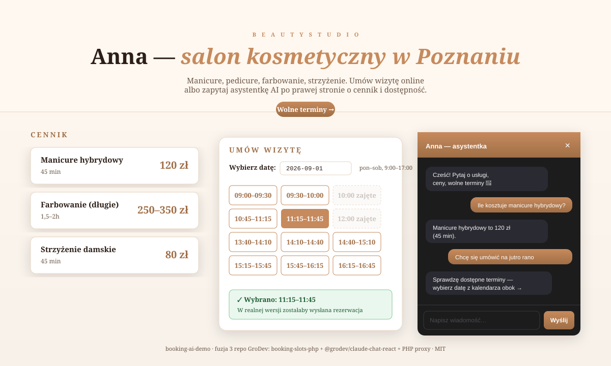

# booking-ai-demo

[](LICENSE) [](https://www.php.net) [](https://react.dev) [](https://www.anthropic.com/api) [](https://grodev.pl)

> 🇵🇱 **Praca AI-first (PL).** Demo integracji trzech moich publicznych repo — pokazuje, jak izolowane komponenty (`booking-slots-php`, `@grodev/claude-chat-react`, PHP proxy z `claude-chat-widget`) składają się w **realny, działający produkt biznesowy** (landing salonu kosmetycznego z rezerwacjami i asystentem AI). Podział pracy człowiek/AI, znane pułapki, weryfikacja: [CLAUDE.md](CLAUDE.md). Konfiguracja agenta review: [.claude/commands/integration-audit.md](.claude/commands/integration-audit.md).



**Beauty Studio Anna** — a working demo landing page for a fictional beauty salon in Poznań, combining three real GroDev projects into one integrated product:

| Piece | Repo | What it does here |
|---|---|---|
| **`grodev/booking-slots`** | [booking-slots-php](https://github.com/GronskiDeveloper/booking-slots-php) | Backend engine: given salon hours + existing bookings, computes free 30-min slots |
| **`@grodev/claude-chat-react`** | [claude-chat-react](https://github.com/GronskiDeveloper/claude-chat-react) · [npm](https://www.npmjs.com/package/@grodev/claude-chat-react) | Frontend widget: floating chat launcher, salon assistant on Claude API |
| **Claude API PHP proxy** | [claude-chat-widget](https://github.com/GronskiDeveloper/claude-chat-widget) (same wire format) | Backend proxy: keeps `ANTHROPIC_API_KEY` off the browser, streams SSE to the widget |

The point of this repo isn't the individual components — it's **the glue**. The salon assistant's system prompt is written so it **delegates availability questions to the calendar next to it** ("I'll check available times — which date?") instead of hallucinating slots. That's an architectural decision, not a prompt tweak.

## Run it locally

You'll need PHP 8.1+ and Node 18+ installed.

```bash
# One-time setup
cd backend  && composer install
cd ../frontend && npm install
cd ..

# Two terminals:
# Terminal A — backend (Claude proxy + slots API)
ANTHROPIC_API_KEY=sk-ant-... php -S localhost:8000 -t backend/public

# Terminal B — frontend (Vite dev server)
cd frontend && npm run dev
```

Open **http://localhost:5173** — salon landing with:
- **Pricing table** (top)
- **Calendar** (pick a date → see free slots, pre-loaded fake bookings on 2026-09-01 and 2026-09-02)
- **Floating AI assistant** (bottom-right) — try:
  - „Ile kosztuje manicure hybrydowy?" → gives price from system prompt
  - „Chcę się umówić na jutro" → asks for date, delegates to calendar instead of guessing

## Architecture at a glance

```
Browser (React + @grodev/claude-chat-react)
   │
   ├─ /api/slots.php?date=YYYY-MM-DD  ──▶  slots.php  ──▶  grodev/booking-slots  ──▶  bookings.json
   │
   └─ POST /api/chat.php  (SSE)       ──▶  chat.php   ──▶  Claude API (key stays on server)
                                                              ▲
                                                              │
                                    system prompt tells Claude
                                    "delegate availability to
                                    the calendar; don't guess"
```

Vite dev-server proxies `/api/*` → `http://localhost:8000` (PHP) so the browser sees a single origin. In production, deploy both under the same domain (Apache/nginx routing `.php` to PHP-FPM, static assets to `dist/`) — no CORS needed.

## Repository layout

```
booking-ai-demo/
├── backend/
│   ├── composer.json           # depends on grodev/booking-slots + anthropic-ai/sdk
│   ├── data/
│   │   └── bookings.json       # fake existing bookings (2 for 2026-09-01, 2 for 2026-09-02)
│   └── public/
│       ├── slots.php           # GET  /api/slots.php?date=YYYY-MM-DD → free slots JSON
│       └── chat.php            # POST /api/chat.php → Claude API SSE proxy
├── frontend/
│   ├── package.json            # depends on @grodev/claude-chat-react
│   ├── vite.config.ts          # /api/* → localhost:8000 proxy for dev
│   ├── index.html
│   └── src/
│       ├── main.tsx
│       ├── App.tsx             # salon landing + pricing + calendar + <ClaudeChat/>
│       ├── App.module.css      # terracotta+cream palette, serif fonts
│       ├── BookingCalendar.tsx # fetches /api/slots.php, renders slot grid
│       └── global.css
├── CLAUDE.md                   # AI-first workflow — human/AI split for this repo
├── .claude/
│   └── commands/
│       └── integration-audit.md # slash command: 8-point audit of the fusion
├── docs/
│   └── preview.svg             # readme preview image
├── LICENSE                     # MIT
└── README.md
```

## What this demo does NOT do (deliberately)

- **Real booking** — clicking a slot shows a confirmation message, doesn't POST anywhere. Real booking needs: atomic insert with a unique constraint on `(date, start)` to survive concurrent writes, email confirmation, rate limiting, and probably a payment flow. That's a separate project — the point of this repo is showing the fusion, not shipping a full salon SaaS.
- **Multi-staff / multi-resource** — `booking-slots-php` supports it, but the demo uses a single stylist. Extending is straightforward.
- **Admin panel** — salon owner would need a view to accept/reject bookings, block off dates, etc. Not in scope.
- **Payments** — Stripe/Przelewy24 integration is a real business need but orthogonal to the demo's message.

Every one of those is a natural next step. That is what the GroDev [system rezerwacji online](https://grodev.pl/system-rezerwacji-online) service is designed to build — a young studio (JDG since 05.2026), first paid deployments in progress. This repo is the reference architecture.

## Want this on your site?

If you run a business that needs online booking + an AI assistant answering FAQ 24/7 — that's exactly what we build at [GroDev](https://grodev.pl). Reach out and we'll wire it into your real business data (not fake `bookings.json`), your real branding, your real workflow.

## License

MIT.

---

*Made by [Dominik Groński / GroDev](https://grodev.pl) · Poznań, Poland · PHP · React · TypeScript · Claude API*
